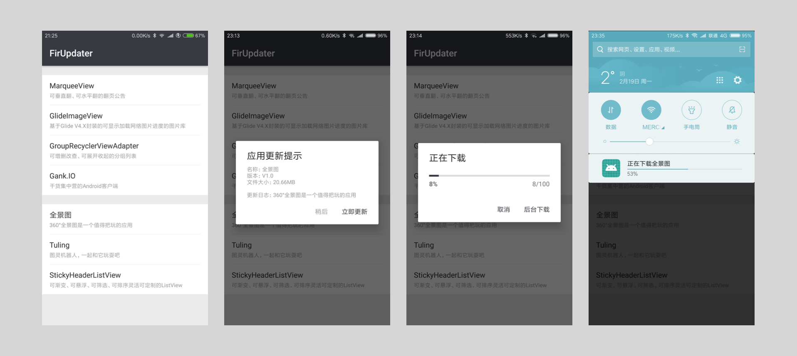

# FirUpdater 

Fir.im通道APK更新器，使用简单，让自己的demo快速具备升级功能

 

### 应用截图

 

### Gradle:

工程的 build.gradle 添加：

    allprojects {
        repositories {
            maven { url 'https://dl.bintray.com/sfsheng0322/maven' }
        }
    }
    
模块的 build.gradle 添加：

    compile 'com.sunfusheng:FirUpdater:<latest-version>'
    
Android 8.0以上需要添加权限

    <uses-permission android:name="android.permission.REQUEST_INSTALL_PACKAGES"/>

 

### 使用

检查升级一行代码即可：

    new FirUpdater(context, YOUR_FIR_API_TOKEN, YOUR_FIR_APP_ID)
        .apkPath(YOUR_APK_PATH)
        .checkVersion();
    
你也可以这样设置：

    new FirUpdater(context)
        .apiToken(YOUR_FIR_API_TOKEN)
        .appId(YOUR_FIR_APP_ID)
        .apkPath(YOUR_APK_PATH)
        .checkVersion();

如果不设置apkPath，默认下载到SDCard的根目录下  

 

### 扫一扫[Fir.im](https://fir.im/FirUpdater)二维码下载APK

 

### 个人微信公众号

 

### 打点赏给作者加点油^_^

 

### 关于我

[GitHub: sfsheng0322](https://github.com/sfsheng0322)  

[个人邮箱: sfsheng0322@126.com](https://mail.126.com/)
  
[个人博客: sunfusheng.com](http://sunfusheng.com/)
  
[简书主页](http://www.jianshu.com/users/88509e7e2ed1/latest_articles)
  
[新浪微博](http://weibo.com/u/3852192525) 